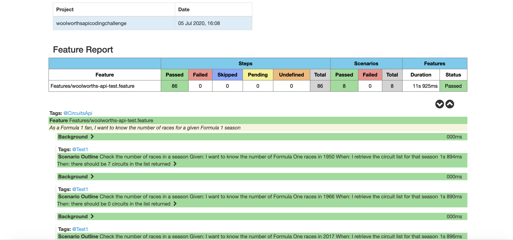

# WoolworthsAPICoding

This project is to set up a API test automation framework to validate the below mentioned scenario
```
API Endpoint : http://ergast.com/api/f1
Feature: CircuitsApi
In order to impress my friends
As a Formula 1 fan
I want to know the number of races for a given Formula 1 season
Scenario Outline: Check the number of races in a season
Given I want to know the number of Formula One races in <season>
When I retrieve the circuit list for that season
Then there should be <numberOfCircuits> circuits in the list returned
Examples:
| season | numberOfCircuits |
| 2017 | 20 |
| 2016 | 21 |
| 1966 | 9 |
| 1950 | 8 |
```

Note: The emphasis is on the happy path (assume the service works and is
secure) and more about how you go about solving the problem and
presenting your solution.

## Getting Started

Refer the GitHub url to clone the project -https://github.com/monicabiswal147/woolworthsapicoding.git

The project framework is designed using Karate DSL, Maven along with Junit runner.
The Reports generated are Cucumber HTML Reports.

### Prerequisites


```
IntelliJ/Eclipse IDE
```

## Running the tests

The tests are written in the woolworths-api-test.feature file. The helper javasript file is Season.js.

Tests can be run using the Maven command

To run all the feature files
```
mvn test "-Dkarate.options=--tags ~@ignore" -Dtest=CucumberRunner
```

To run with selective tags

```
mvn test "-Dkarate.options=--tags @CircuitsApi" -Dtest=CucumberRunner
```
### Cucumber Reports


<div align="center">
     
</div>


## Authors

Monica Biswal (Final Draft)

